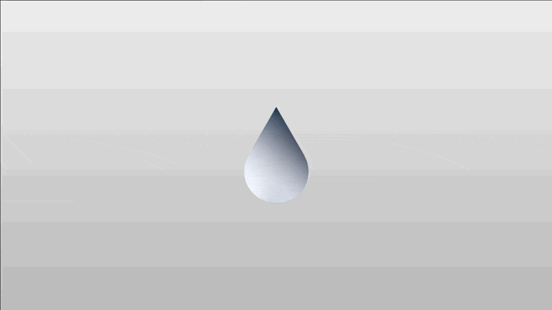

<p align="center">
  
</p>

# 💧 Liquid Image

A React component for creating liquid metal effects on images.

Just for fun, complete ripoff of: <a href="https://liquid.paper.design">liquid.paper.design</a>
- https://github.com/paper-design/liquid-logo

## Installation

```bash
npm install liquid-image
```

## Usage

```tsx
import { LiquidImage } from 'liquid-image'

<LiquidImage src="/liquid-image.png" invert showControls />
```

## Props

| Prop | Type | Default | Description | Range |
|------|------|---------|-------------|--------|
| `src` | `string` | - | The URL of the image to display | - |
| `invert` | `boolean` | `false` | Invert the liquid image | - |
| `className` | `string` | - | The className of the container | - |
| `width` | `number` | - | The width of the image, overrides img width if provided | - |
| `height` | `number` | - | The height of the image, overrides img height if provided | - |
| `background` | `string` | `'transparent'` | The background color of the image | - |
| `refraction` | `number` | `0.015` | Refraction amount | `[0, 0.06]` |
| `edge` | `number` | `0.4` | Edge thickness | `[0, 1]` |
| `patternBlur` | `number` | `0.005` | Pattern blur amount | `[0, 0.05]` |
| `liquid` | `number` | `0.07` | Liquid distortion amount | `[0, 1]` |
| `speed` | `number` | `0.3` | Animation speed | `[0, 1]` |
| `patternScale` | `number` | `2` | Pattern scale | `[1, 10]` |
| `showControls` | `boolean` | `false` | Display the controls panel | - |
